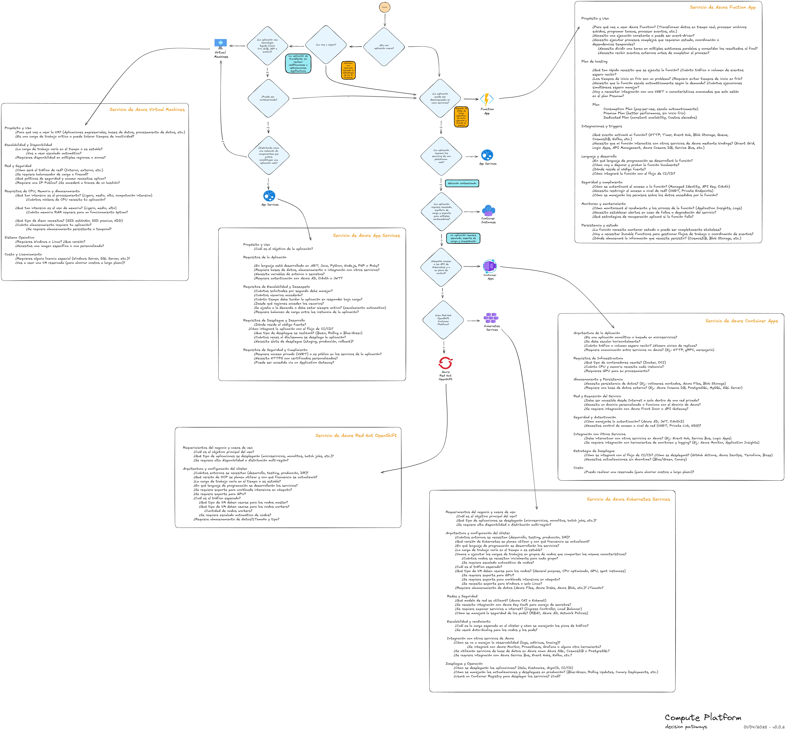

# Desarrollo agente caso de uso 1 - Recomendador servicios Azure

## Consigna

Los equipos deben realizar el desarrollo de un agente que sea capaz de:
- Recomendar el servicio de Azure más adecuado según las necesidades del usuario.
- El agente deberá basarse en un árbol de decisión provisto (imagen) para determinar la mejor recomendación.
- Realizar consultas apropiadas al servicio.
- Generar un resumen final con el servicio y respuestas.

## Contexto del Problema

Los desarrolladores necesitan seleccionar servicios cloud adecuados según distintos criterios, tales como:

- Tipo de aplicación (nueva, legacy).
- Capacidad de descomponer en nano servicios.
- Stack tecnologico.
- Necesidad de K8 / Openshift.

Para facilitar esta tarea, se utilizará un árbol de decisión como base lógica.

## Requerimientos del Agente

El agente debe:

- Interpretar las necesidades del usuario mediante inputs conversacionales.
- Seguir la lógica definida en el árbol de decisión proporcionado.
- Recomendar el servicios de Azure como resultado.
- Recolectar los datos necesarios en función del tipo de servicio.

## Plataforma de Desarrollo

El agente debe ser desarrollado utilizando:

- Watsonx Orchestrate

Se permite el uso de:

- Tools nativas de orchestrate
- Tools desarrolladas por los equipos
- Uso de Knowledge base
- Servicios de IBM Cloud

## Uso de Herramientas y Servicios

Pueden utilizar:
- Ingenieria de prompt
- Uso de librerias como langchain, fastapi, etc
- APIs externas (importando las tools con openapi)
- Bases de datos
- Middleware

** Importante: La arquitectura es libre, aunque se recomienda adaptar la solución a las habilidades del equipo.**

## Requisito de Despliegue (Obligatorio si hay código)

Si el desarrollo incluye:
- Código custom (Python, Node.js, etc.)
- APIs propias
- MCP servers que no esten ya desplegados
- Bases de datos
- Middleware

**Debe estar contenerizado en Docker**

Esto es necesario porque:
- El tutor realizará el despliegue en Code Engine
- Se requiere portabilidad y facilidad para desplegar

## Criterio de evaluación

El agente debe:

Interpretar correctamente el árbol de decisión (imagen provista)
Traducirlo a lógica ejecutable (flows, reglas, prompts, etc.)
Garantizar que las recomendaciones sean consistentes con dicho árbol
